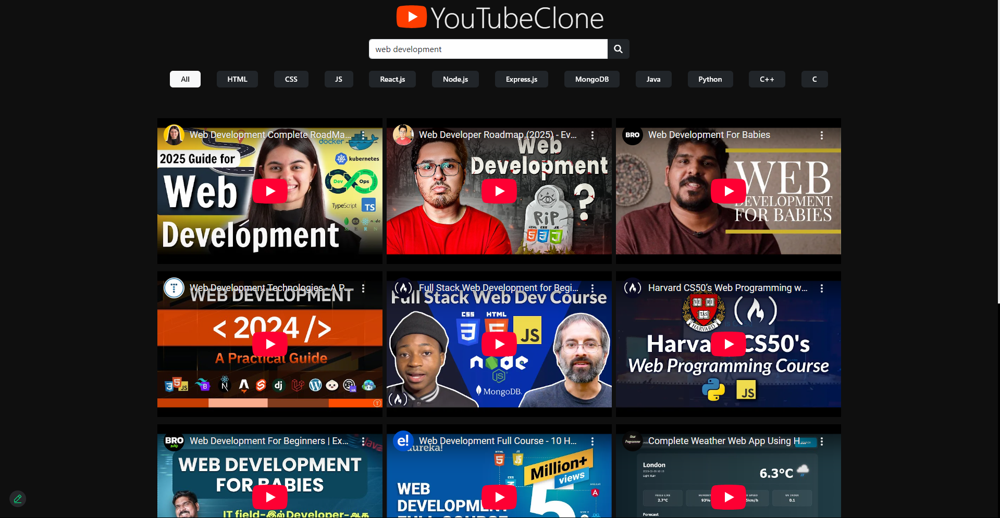
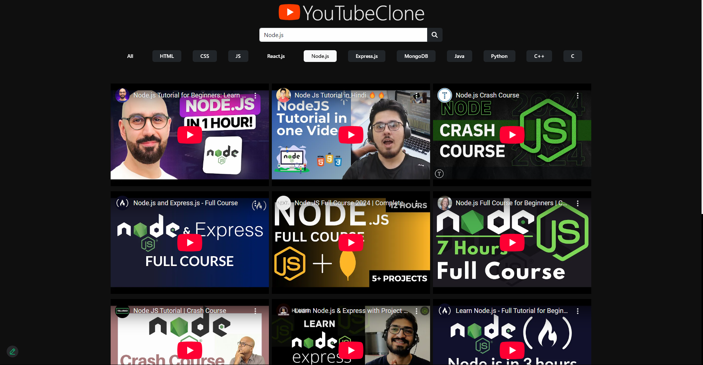
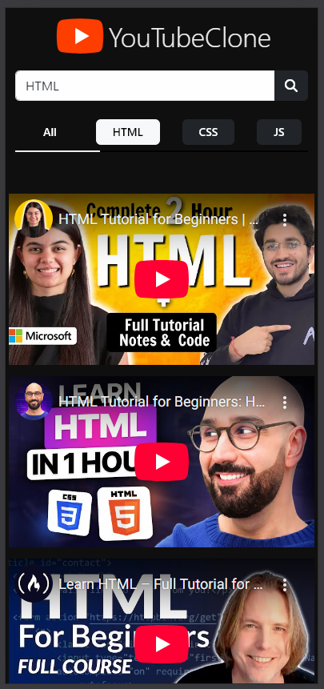
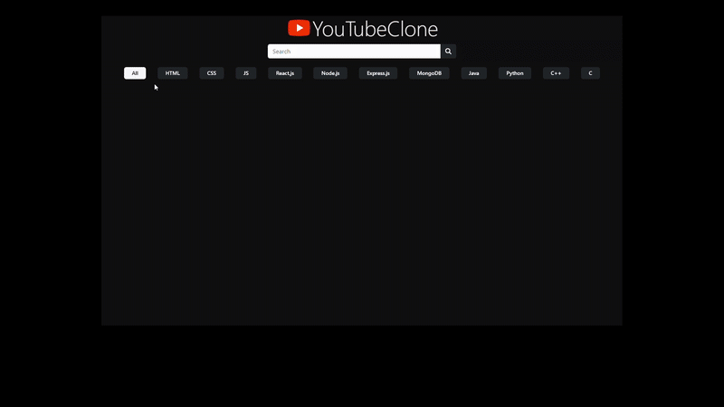
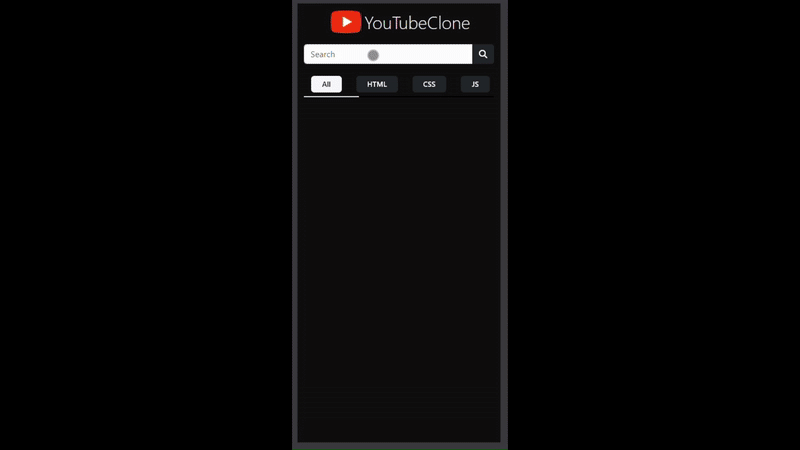

# YouTube Clone

## Overview
This is a YouTube Clone built using **HTML, CSS, and JavaScript**. It allows users to search for YouTube videos and watch them directly from the application. The project was created while mentoring beginners to help them understand the fundamentals of frontend development and API integration.

## Features
- **Search YouTube Videos** using the **YouTube Data API v3**
- **Responsive Design** for Desktop and Mobile views
- **Topic-based search** with selectable badges
- **Bootstrap Integration** for better UI styling
- **Optimized for beginner developers** to learn frontend web development

## Technologies Used
- **HTML** for structuring the web page
- **CSS (Bootstrap 5 & Custom Styling)** for designing the layout
- **JavaScript (ES6+ Fetch API)** for handling user interactions and API requests

## Setup and Installation
### Prerequisites
To run this project locally, you need:
- A **YouTube API Key** (Create one at [Google Cloud Console](https://console.cloud.google.com/apis/credentials))

### Steps to Run Locally
1. **Clone the repository:**
   ```sh
   git clone https://github.com/AnkitKumarMishra5/youtube-clone
   ```
2. **Navigate to the project folder:**
   ```sh
   cd youtube-clone
   ```
3. **Open the `index.js` file and add your YouTube API Key:**
   ```js
   const API_KEY = 'YOUR_YOUTUBE_API_KEY_HERE';
   ```
4. **Open `index.html` in a browser** (Double-click or use Live Server in VS Code)

## File Structure
```
📂 youtube-clone
├── 📄 index.html        # Main HTML file
├── 📄 index.css         # Stylesheet
├── 📄 index.js          # JavaScript logic
├── 📂 assets            # Logos and other static files
└── 📂 snapshots         # Screenshots and screen recordings for documentation
```

## Screenshots
### Desktop View



### Mobile View


## Screen Recording
To demonstrate the working of the project, here are the screen recordings:



## How It Works
1. **Search for Videos**: Enter a search term and click the search button.
2. **Select Topics**: Click on a topic badge to show results based on that topic.
3. **Watch Videos**: Click on any video to play it inside an embedded YouTube player.

## License
This project is open-source under the MIT License. Feel free to use and modify it!
